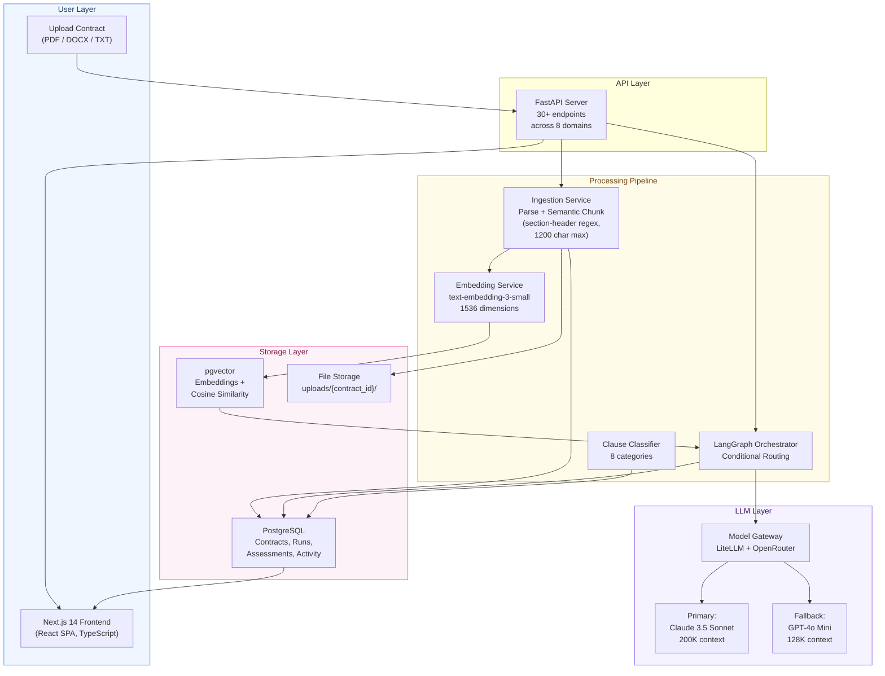
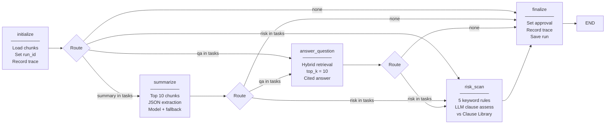
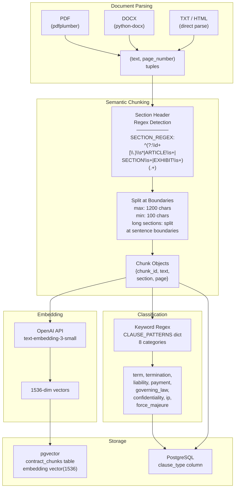
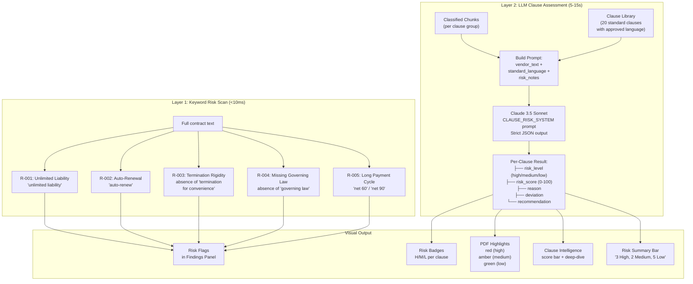
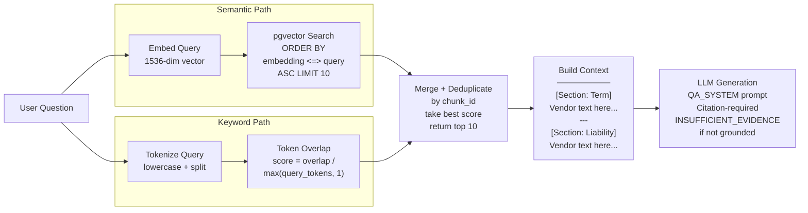
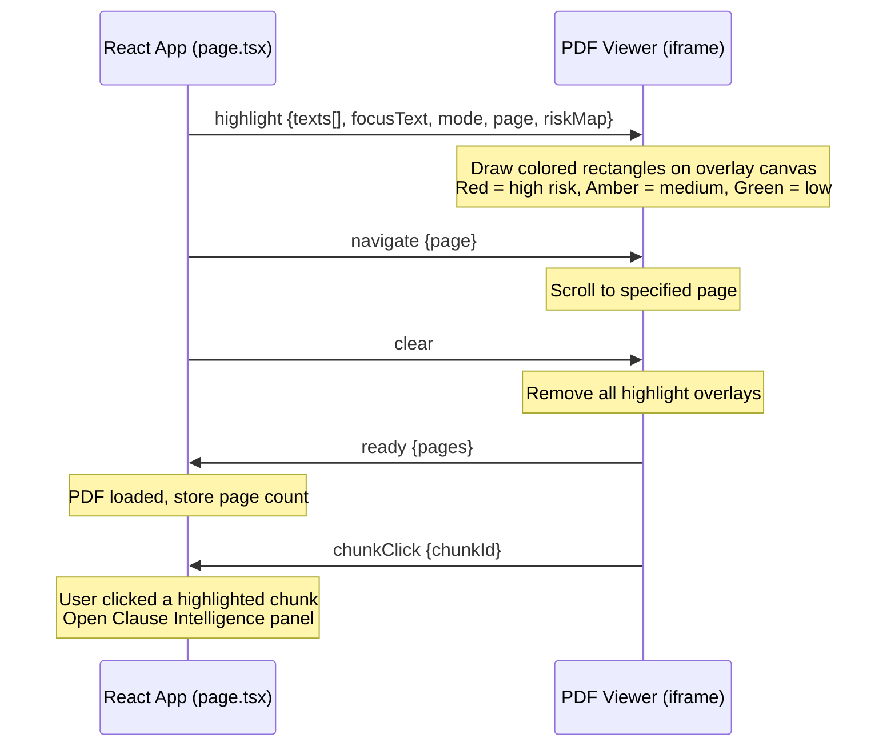
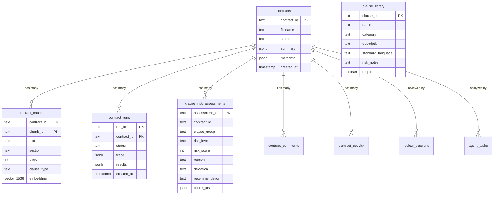

# Contract Intelligence Platform — Technical Reference

**Prepared by**: Kartik Reddy K
**Date**: March 2026
**Version**: 1.0

> This document is the technical companion to the panel presentation. It covers scope, architecture decisions, design diagrams, and implementation details. Intended for technical reviewers who want to go deeper.

---

## Table of Contents

1. [Scope of the Assignment](#1-scope-of-the-assignment)
2. [What We Built Beyond Scope](#2-what-we-built-beyond-scope)
3. [High-Level Design](#3-high-level-design)
4. [Low-Level Design](#4-low-level-design)
5. [Data Model](#5-data-model)
6. [Risk Assessment Pipeline](#6-risk-assessment-pipeline)
7. [Retrieval Strategy](#7-retrieval-strategy)
8. [Model Strategy](#8-model-strategy)
9. [Prompting Strategy](#9-prompting-strategy)
10. [Frontend Architecture](#10-frontend-architecture)
11. [Production Readiness](#11-production-readiness)
12. [FAQs](#12-faqs)
13. [Appendix](#13-appendix)

---

## 1. Scope of the Assignment

The case study asked for a **prototype agentic GenAI contract assistant** that can:

| # | Requirement | Status |
|---|------------|--------|
| 1 | Summarize key clauses in contracts | DONE |
| 2 | Answer natural language questions about contract terms | DONE |
| 3 | Automatically flag risky, expiring, or non-compliant clauses | DONE |
| 4 | Orchestrator agent to interpret user intent and route tasks | DONE |
| 5 | Specialized agents: Document ingestion (PDF, DOCX, OCR) | DONE (OCR deferred) |
| 6 | Specialized agents: Clause extraction and normalization | DONE |
| 7 | Specialized agents: Summarization | DONE |
| 8 | Specialized agents: Q&A | DONE |
| 9 | Specialized agents: Risk and compliance analysis | DONE |
| 10 | Agents share structured contract state (JSON) with traceable outputs | DONE |
| 11 | LLM with strong reasoning and long-context support | DONE |
| 12 | Embedding model for semantic retrieval over contract text | DONE |
| 13 | Role-specific prompts per agent | DONE |
| 14 | Strict output schemas | DONE |
| 15 | Citation-required responses to reduce hallucinations | DONE |
| 16 | Parse and chunk contracts by semantic sections | DONE |
| 17 | Store chunks and metadata in a vector database | DONE |
| 18 | (Bonus) UI: upload contracts, view highlighted clauses, ask questions, review flagged risks with source citations | DONE |

**All 17 core requirements + the bonus UI are implemented.**

---

## 2. What We Built Beyond Scope

These features were not in the case study but were informed by competitive research into CLM platforms (Evisort, Ironclad, SpotDraft) and best practices in enterprise procurement workflows.

| Feature | Why |
|---------|-----|
| **PDF-first risk highlights** | Enterprise reviewers work inside the document — intelligence should be layered on the PDF, not in a separate view. |
| **Per-clause risk scoring (0-100)** | Granular, per-clause scores enable prioritized review and comparison across contracts. |
| **Clause Library + playbook comparison** | Enables compliance gap analysis — does the vendor language match our approved standard? |
| **Two-layer risk assessment** (keyword + LLM) | Defense in depth. Keywords are fast and reliable. LLM catches nuance. |
| **Clause Intelligence deep-dive panel** | Per-clause risk breakdown: score, reason, deviation, recommendation. |
| **Contract lifecycle timeline** | Visual timeline of effective date, renewal window, and expiration for at-a-glance lifecycle awareness. |
| **Portfolio dashboard** | Cross-contract analytics for procurement leadership. |
| **Sentinel AI** (8 configurable review templates) | Structured deep-dive reviews using curated prompts. |
| **Autopilot** (autonomous portfolio tasks) | Batch operations across multiple contracts. |
| **Document generation** (NLQ → contract) | Template-based contract drafting with natural language instructions. |
| **Workflow management** (Kanban) | Multi-step approval processes for contract lifecycle. |
| **Debug / Trace mode** | Full transparency into the AI pipeline for trust and auditability. |
| **Keyboard shortcuts** | Arrow keys, `R` for next risk, `Escape` to clear — enterprise-grade navigation. |
| **Evaluation framework** | Golden test set with LLM-as-judge scoring on real contract data. |

---

## 3. High-Level Design

### 3.1 System Architecture



### 3.2 Request Flow (Upload → Analysis → Display)

```
User uploads PDF
    │
    ▼
POST /api/v1/contracts/ingest
    ├── Save file to disk
    ├── Parse text (pdfplumber / python-docx)
    ├── Semantic chunking (section-header regex, 1200 char max, 100 min)
    ├── Generate embeddings (text-embedding-3-small → 1536-dim vectors)
    ├── Store chunks + embeddings in PostgreSQL + pgvector
    ├── Classify chunks into 8 clause categories
    └── Return contract_id
    │
    ▼
POST /api/v1/contracts/{id}/analyze (tasks: [summary, risk])
    │
    ▼
LangGraph StateGraph
    ├── initialize: Load chunks, set run_id, record trace
    ├── route_after_init: Conditional — check which tasks are requested
    ├── summarize: Top 10 chunks → Claude → Strict JSON → Extract parties, dates, terms
    ├── risk_scan:
    │   ├── Layer 1: Keyword scan (5 regex patterns, <10ms)
    │   └── Layer 2: LLM clause assessment (per-clause vs Clause Library, 5-15s)
    └── finalize: Set approval status, record trace, save run
    │
    ▼
Frontend renders:
    ├── Overview tab: Metrics, key terms, risk score
    ├── Contents tab: PDF with risk-colored highlights + Findings panel
    ├── Lifecycle tab: Timeline visualization
    └── AI Chat: Suggested questions, citation-linked answers
```

---

## 4. Low-Level Design

### 4.1 Agentic Architecture — How Agents Communicate

This system implements a **multi-agent orchestration pattern** using LangGraph. The architecture has five core concepts: **agent identity**, **shared state (blackboard)**, **orchestrator routing**, **inter-agent data flow**, and **traceable execution**.

#### Agent Identity

Every agent inherits from `BaseAgent` and declares its identity:

```python
class BaseAgent(ABC):
    name: str          # e.g., "SummarizationAgent"
    role: str          # e.g., "Extract key commercial terms..."
    system_prompt: str # Role-specific LLM instructions
    tools: list[str]   # Capabilities: ["llm_generate", "vector_search", ...]

    @abstractmethod
    def execute(self, state: ContractState) -> ContractState:
        """Read from shared state, perform work, write results back."""
```

| Agent | Role | Tools | Reads From State | Writes To State |
|-------|------|-------|-----------------|-----------------|
| **OrchestratorAgent** | Interpret user intent, route to specialists | `llm_classify`, delegates to all others | `question` | `tasks` (routed) |
| **SummarizationAgent** | Extract key commercial terms into structured JSON | `llm_generate` | `chunks` | `summary` (parties, dates, terms, obligations) |
| **QAAgent** | Answer questions with cited evidence | `llm_generate`, `vector_search`, `keyword_search` | `chunks`, `question` | `qa` (answer, citations, retrieved_chunk_ids) |
| **ClauseExtractionAgent** | Classify chunks into 8 clause categories | `regex_classify` / `llm_classify` | `chunks` | `clause_classifications`, `clause_highlights` |
| **RiskComplianceAgent** | Detect risks via keyword rules + LLM assessment | `keyword_scan`, `llm_assess`, `clause_library_lookup` | `chunks`, `clause_highlights` | `risk_flags`, `clause_assessments` |

#### Shared State — The Blackboard Pattern

Agents communicate through a **shared `ContractState`** — a structured Pydantic model that acts as a blackboard. Each agent reads the fields it needs and writes its outputs. No agent calls another agent directly; they communicate exclusively through state.

```python
class ContractState(BaseModel):
    # ── Identity ──
    run_id: str
    contract_id: str
    mode: str                                    # "agent"
    tasks: list[str]                             # ["summary", "qa", "risk"]

    # ── Ingestion Agent outputs ──
    chunks: list[ChunkState]                     # Parsed text chunks
    metadata: dict                               # Document metadata

    # ── Clause Extraction Agent outputs ──
    clause_classifications: list[ClauseClassification]  # chunk_id → clause_type
    clause_highlights: dict[str, list[dict]]     # Grouped by category

    # ── Summarization Agent outputs ──
    summary: SummaryState                        # Structured JSON extraction

    # ── Q&A Agent outputs ──
    qa: QAState                                  # Answer + citations + retrieved chunks

    # ── Risk Agent outputs ──
    risk_flags: list[RiskFlagState]              # Keyword rule matches
    clause_assessments: list[ClauseAssessmentState]  # Per-clause LLM scores

    # ── Trace — append-only audit log ──
    trace: list[AgentTrace]                      # Every agent appends here
```

**Why a blackboard?**
- Agents are decoupled — the Summarization Agent doesn't know the Risk Agent exists
- Adding a new agent means adding a new output field, not changing existing agents
- The full state is serializable (JSON) and persistable alongside each run
- Any agent can read any other agent's prior outputs (e.g., Risk reads Clause Extraction's classifications)

#### Inter-Agent Data Flow

This diagram shows how data flows between agents through the shared state — each agent enriches the state for downstream agents:

```
                    ContractState (shared blackboard)
                    ┌─────────────────────────────────────┐
                    │  chunks[]        ← Ingestion writes  │
User ──▶ Orchestrator │  tasks[]         ← Orchestrator sets │
         (intent    │  question?       ← User provides     │
          routing)  │                                      │
                    │  clause_classifications[]             │
            ┌───────│    ← ClauseExtraction writes         │
            │       │  clause_highlights{}                  │
            │       │    ← ClauseExtraction writes         │
            │       │                                      │
            ▼       │  summary{}                           │
    Summarization ──│    ← Summarization writes            │
            │       │                                      │
            ▼       │  qa.answer, qa.citations[]           │
         Q&A    ────│    ← QA writes                       │
            │       │  qa.retrieved_chunk_ids[]             │
            │       │    ← QA writes (retrieval lineage)   │
            ▼       │                                      │
        Risk    ────│  risk_flags[]                        │
     (reads clause_ │    ← Risk writes (keyword layer)    │
      highlights    │  clause_assessments[]                 │
      from state)   │    ← Risk writes (LLM layer)        │
            │       │                                      │
            ▼       │  trace[]                             │
        Finalize ───│    ← EVERY agent appends here        │
                    └─────────────────────────────────────┘
                                    │
                                    ▼
                            Persisted as JSON
                          alongside the run record
```

**Key inter-agent dependency**: The Risk Agent reads `clause_highlights` that the Clause Extraction Agent wrote. If clause extraction hasn't run yet, the Risk Agent automatically triggers it first:

```python
def risk_scan(state: WorkflowState) -> WorkflowState:
    cs = _get_cs(state)
    if not cs.clause_highlights:           # ← check if upstream agent has run
        cs = ClauseExtractionAgent().execute(cs)  # ← trigger dependency
    cs = RiskComplianceAgent().execute(cs)
    return _sync_back(state, cs)
```

#### Orchestrator — LLM-Powered Intent Routing

The Orchestrator Agent uses an LLM to interpret user intent and decide which specialists to invoke. This is what makes the system truly agentic — the routing decision is made by AI, not hardcoded.

```
User: "Are there any red flags in the liability section?"
                    │
                    ▼
        ┌─────────────────────────┐
        │   OrchestratorAgent      │
        │   (INTENT_ROUTER_SYSTEM) │
        │                         │
        │   LLM classifies:       │
        │   tasks: ["risk"]       │
        │   reasoning: "User asks │
        │    about risk flags in  │
        │    a specific clause"   │
        └────────────┬────────────┘
                     │
                     ▼
        Route to RiskComplianceAgent only
        (skip Summarization, skip Q&A)
```

The Orchestrator's system prompt defines 6 available task types and routing rules:

| User Says | Orchestrator Routes To |
|-----------|-----------------------|
| "Summarize this contract" | `["summary"]` |
| "What are the payment terms?" | `["qa"]` |
| "Any red flags?" | `["risk"]` |
| "Compare liability to our playbook" | `["qa", "compare"]` |
| "Review this contract" | `["summary", "risk"]` |
| "Explain Section 3.2" | `["qa", "explain"]` |

If the LLM fails to classify (JSON parse error, timeout), the system falls back to `["qa"]` — safe default.

#### Traceable Execution — AgentTrace

Every agent invocation creates an `AgentTrace` record:

```python
class AgentTrace(BaseModel):
    trace_id: str              # Unique ID (tr_a1b2c3d4)
    agent_name: str            # "RiskComplianceAgent"
    agent_role: str            # "Detect risks via keyword rules + LLM..."
    started_at: datetime
    completed_at: datetime
    duration_ms: int           # 12450
    status: str                # "completed" | "failed"
    model_used: str            # "claude-3.5-sonnet"
    input_keys: list[str]      # ["chunks", "clause_highlights"]
    output_keys: list[str]     # ["risk_flags", "clause_assessments"]
    details: dict              # Agent-specific metrics
    error: str | None          # Null on success
```

The trace creates a **complete audit trail** of which agent ran, what it read, what it wrote, which model it used, how long it took, and whether it succeeded. The Debug panel in the UI renders this as a timeline.

```
Trace for run_abc123:
┌─ tr_001  WorkflowInit      0ms     ✓  Loaded 42 chunks, tasks=[summary,risk]
├─ tr_002  SummarizationAgent 4200ms  ✓  model=claude-3.5-sonnet, parsed_ok=true
├─ tr_003  ClauseExtraction   85ms    ✓  8 categories, 38 chunks classified
├─ tr_004  RiskCompliance     12450ms ✓  keyword: 2 flags, LLM: 8 assessments
└─ tr_005  WorkflowFinalize   1ms     ✓  Total trace entries: 5
```

### 4.2 LangGraph State Machine

The LangGraph `StateGraph` defines the execution topology — which agents run in what order, with conditional routing at each step:



**Why LangGraph over a simple function chain?**

| Aspect | Function Chain `f(g(h(x)))` | LangGraph StateGraph |
|--------|---------------------------|---------------------|
| Routing | Linear — every function runs | Conditional — agents are skipped based on intent |
| State | Passed as arguments, no persistence | Typed shared state, checkpointable |
| Tracing | Manual logging | Built-in trace at every node transition |
| Error handling | Exception propagates, kills everything | Per-node failure, graph can route around failures |
| Extensibility | Add function to chain, change all callers | Add node + edge, existing agents untouched |
| Parallelism | Sequential only | Supports concurrent branches (future) |

**Why not a fully autonomous ReAct agent?**
For contract analysis, **determinism matters**. If you upload a contract for risk review, it must always run through risk analysis — not have the LLM decide "I think I'll skip risk today." The graph enforces that every requested task executes. The Orchestrator uses LLM intelligence for intent classification, but the graph controls execution order.

### 4.3 Ingestion Pipeline (Detail)



### 4.4 Risk Assessment Pipeline (Two Layers)



**Scoring guide:**
- **0-30 (Low)**: Clause closely matches standard approved language
- **31-60 (Medium)**: Notable deviations that warrant attention
- **61-100 (High)**: Missing protections, one-sided terms, or significant financial exposure

### 4.5 Retrieval Pipeline (Hybrid Search)



**Why hybrid?** Legal contracts have both semantic concepts ("liability limitation" = "damages cap") and exact references ("Section 3.2", "ARTICLE VII"). Pure vector search misses exact terms. Pure keyword search misses paraphrased concepts.

### 4.6 Frontend–PDF Communication (postMessage Protocol)



### 4.7 API Endpoint Map

```
Contract Operations
├── GET    /api/v1/contracts                          List all contracts
├── POST   /api/v1/contracts/ingest                   Upload + parse + embed
├── POST   /api/v1/contracts/{id}/analyze             Run LangGraph workflow
├── POST   /api/v1/contracts/{id}/ask                 Q&A with citations
├── GET    /api/v1/contracts/{id}/file                Serve raw PDF
├── GET    /api/v1/contracts/{id}/chunks              Get parsed chunks
├── GET    /api/v1/contracts/{id}/highlights           Get clause highlights
├── GET    /api/v1/contracts/{id}/suggested-questions  AI-generated questions
├── GET    /api/v1/contracts/{id}/clause-gaps          Compliance gap analysis
├── GET    /api/v1/contracts/{id}/clause-assessments   Per-clause risk scores
├── POST   /api/v1/contracts/{id}/clause-assessments/run  Trigger LLM assessment
├── POST   /api/v1/contracts/{id}/explain              AI explain a clause
└── POST   /api/v1/contracts/{id}/playbook-compare     Side-by-side comparison

Run Operations
├── GET    /api/v1/contracts/{id}/runs                List runs
├── GET    /api/v1/contracts/{id}/risks               Get risk flags
├── POST   /api/v1/runs/{id}/approve                  Approve/reject run
├── GET    /api/v1/runs/{id}/trace                    Get execution trace
└── GET    /api/v1/runs/{id}                          Get run details

Collaboration
├── GET    /api/v1/contracts/{id}/comments            List comments
├── POST   /api/v1/contracts/{id}/comments            Add comment
└── GET    /api/v1/contracts/{id}/activity             Audit trail

Clause Library
├── GET    /api/v1/clause-library                     List standard clauses
├── POST   /api/v1/clause-library                     Add clause
├── PUT    /api/v1/clause-library/{id}                Update clause
└── DELETE /api/v1/clause-library/{id}                Remove clause

Sentinel AI
├── GET    /api/v1/sentinel/prompts                   List review templates
├── POST   /api/v1/sentinel/prompts                   Add template
├── POST   /api/v1/sentinel/review                    Run structured review
└── GET    /api/v1/sentinel/sessions                  List review sessions

Autopilot
├── GET    /api/v1/autopilot/templates                Task templates
├── POST   /api/v1/autopilot/tasks                    Create task
└── POST   /api/v1/autopilot/tasks/{id}/execute       Execute task

Document Generation
├── GET    /api/v1/templates                          List doc templates
├── POST   /api/v1/templates/{id}/generate            Generate document
└── GET    /api/v1/generated-docs                     List generated docs

Workflows
├── GET    /api/v1/workflows                          List workflows
├── POST   /api/v1/workflows                          Create workflow
└── PATCH  /api/v1/workflows/{id}/steps/{sid}         Update step

Dashboard
└── GET    /api/v1/dashboard/insights                 Portfolio analytics
```

---

## 5. Data Model

### 5.1 Entity Relationship



### 5.2 Key Table: contract_chunks

```sql
CREATE TABLE contract_chunks (
    contract_id   TEXT NOT NULL REFERENCES contracts(contract_id) ON DELETE CASCADE,
    chunk_id      TEXT NOT NULL,
    text          TEXT NOT NULL,
    section       TEXT,
    page          INT,
    clause_type   TEXT,
    embedding     vector(1536),
    PRIMARY KEY (contract_id, chunk_id)
);

CREATE INDEX ON contract_chunks
    USING hnsw (embedding vector_cosine_ops);
```

The `embedding` column uses pgvector's `vector(1536)` type. The HNSW index enables sub-50ms cosine similarity search at scale.

---

## 6. Risk Assessment Pipeline

### Why Two Layers?

| Aspect | Keyword Scan (Layer 1) | LLM Assessment (Layer 2) |
|--------|----------------------|--------------------------|
| Speed | <10ms | 5-15 seconds |
| Accuracy | High precision, low recall | High recall, potential hallucination |
| Hallucination risk | Zero | Mitigated by grounding + schema validation |
| Nuance | None — exact pattern match | Understands context, detects one-sided terms |
| Dependency | None | Requires Clause Library |
| Coverage | 5 known patterns | Any clause type in the library |

**Together**: Keywords catch obvious issues instantly. LLM catches subtle deviations that require language understanding. Neither alone is sufficient.

### Clause Library

The Clause Library is a database of 20 standard clause definitions. Each entry includes:

- **name**: e.g., "Limitation of Liability"
- **standard_language**: The approved language (what "good" looks like)
- **risk_notes**: What to watch for (e.g., "Watch for uncapped liability")
- **required**: Whether this clause must be present in every contract

The LLM compares vendor text against `standard_language` to detect deviations. Missing `required` clauses are automatically flagged as high risk.

---

## 7. Retrieval Strategy

### Hybrid Retrieval

We combine two retrieval methods:

1. **Semantic search**: Embed the query → cosine similarity against pgvector → top-k
2. **Keyword search**: Token overlap scoring → top-k
3. **Merge**: Deduplicate by chunk_id, take best score, return top 10

### Parameters

| Parameter | Value | Rationale |
|-----------|-------|-----------|
| Embedding model | text-embedding-3-small | Strong on legal/business text, cost-effective |
| Dimensions | 1536 | Standard for OpenAI embeddings |
| top_k (Q&A) | 10 | 10 chunks × ~300 tokens = 3K tokens — well within Claude's 200K window |
| top_k (risk citations) | 2 | Only need 1-2 supporting chunks |
| Similarity metric | Cosine distance (`<=>`) | Direction-based, robust to chunk length variation |
| Chunk size | 1200 chars max, 100 min | Captures complete clauses without noise |

### Improvement Roadmap

1. **Cross-encoder reranking** (BGE-reranker) — re-score top 50 → return top 10
2. **Reciprocal Rank Fusion** — better score merging across retrieval methods
3. **Query expansion** — LLM generates multiple query variants
4. **Metadata filtering** — restrict search by contract type

---

## 8. Model Strategy

### Models Used

| Model | Provider | Purpose | Context Window | Dimensions |
|-------|----------|---------|---------------|------------|
| **Claude 3.5 Sonnet** | Anthropic (via OpenRouter) | Primary LLM for summarization, Q&A, risk assessment, clause classification | 200K tokens | — |
| **GPT-4o Mini** | OpenAI (via OpenRouter) | Fallback LLM — used when Claude is unavailable or rate-limited | 128K tokens | — |
| **text-embedding-3-small** | OpenAI (via OpenRouter) | Embedding generation for semantic search | 8K tokens | 1536 |

### Why These Models?

| Decision | Rationale |
|----------|-----------|
| **Claude 3.5 Sonnet as primary** | Best-in-class for structured JSON extraction, strong reasoning on legal text, 200K context window handles full contracts, follows complex multi-step prompts reliably. |
| **GPT-4o Mini as fallback** | Fast (~3x faster than Sonnet), cheap, different provider than primary (diversifies failure risk — an Anthropic outage doesn't take down the system). |
| **text-embedding-3-small for embeddings** | Strong performance on legal/business text, cost-effective ($0.02/1M tokens), 1536 dimensions provide good semantic resolution. |
| **OpenRouter as gateway** | Single API key for multiple providers. Enables model swapping without code changes. Usage tracking and rate limiting built in. |

### Model Gateway Architecture

All LLM calls route through a **Model Gateway** built on LiteLLM + OpenRouter:

```
Application Code
    │
    ▼
Model Gateway (model_gateway.py)
    ├── litellm.completion(model=PRIMARY_MODEL, ...)
    │       │
    │       ├── Success → return response
    │       └── Failure (timeout, rate limit, error)
    │               │
    │               ▼
    │       litellm.completion(model=FALLBACK_MODEL, ...)
    │               │
    │               ├── Success → return response (used_fallback=True)
    │               └── Failure → raise, record in trace
    │
    ├── litellm.embedding(model=EMBEDDING_MODEL, ...)
    │       └── Returns 1536-dim vector
    │
    └── Response includes: content, model_used, used_fallback, token_counts
```

Every response records `used_fallback: bool` in the trace so we can monitor primary model health.

### Per-Task Model Usage

| Task | Model | Temperature | Why |
|------|-------|-------------|-----|
| **Summarization** | Claude 3.5 Sonnet | 0.0 | Deterministic JSON extraction — same contract should always produce the same summary. |
| **Q&A** | Claude 3.5 Sonnet | 0.3 | Slight creativity for natural-sounding answers, but still grounded in context. |
| **Clause Classification** | Claude 3.5 Sonnet | 0.0 | Classification must be consistent and reproducible. |
| **Risk Assessment** | Claude 3.5 Sonnet | 0.0 | Risk scores must be deterministic — a contract reviewed twice should get the same scores. |
| **Sentinel Reviews** | Claude 3.5 Sonnet | 0.3 | Structured review with some flexibility in phrasing. |
| **Embedding** | text-embedding-3-small | — | Offline batch embedding, no temperature parameter. |

### Cost Estimation

| Task | Input Tokens | Output Tokens | Cost per Contract |
|------|-------------|---------------|-------------------|
| Summarization | ~3,000 | ~500 | ~$0.012 |
| Q&A (per question) | ~3,000 | ~300 | ~$0.010 |
| Risk Assessment | ~5,000 | ~2,000 | ~$0.045 |
| Embedding (all chunks) | ~9,000 | — | ~$0.0002 |
| **Total (full analysis)** | | | **~$0.07 per contract** |

At scale: ~$70 per 1,000 contracts for full analysis.

### Model Evaluation Approach

To evaluate whether to switch models (e.g., Claude 3.5 → Claude 4, or GPT-4o):

1. **A/B testing**: Run the same contracts through both models
2. **Compare**: JSON parse success rate, risk flag agreement with human labels, summarization completeness
3. **Measure**: Latency, cost per contract, hallucination rate
4. **LLM-as-judge**: Use a stronger model to rate output quality on a 1-5 scale
5. **Key metric**: "Does the risk assessment match what a human procurement analyst would flag?"

### Production Model Improvements

| Improvement | Impact | Effort |
|-------------|--------|--------|
| **Per-task model routing** — use cheaper models for low-stakes tasks (classification) and stronger models for high-stakes tasks (risk assessment) | 30-50% cost reduction | 2 days |
| **Streaming responses** — stream LLM tokens to frontend via SSE for perceived speed | Better UX, no accuracy change | 3 days |
| **On-premise option** — Llama 3 / Mistral for organizations that can't send data to external APIs | Data sovereignty | 2 weeks |
| **Fine-tuned classifier** — fine-tune a small model for clause classification instead of using Claude | 10x faster classification, lower cost | 1 week |
| **Confidence-based routing** — if primary model returns low-confidence output, automatically retry with a stronger model | Higher accuracy | 3 days |

---

## 9. Prompting Strategy

### Five Role-Specific System Prompts

| Prompt | Role | Key Constraints |
|--------|------|----------------|
| `SUMMARIZE_SYSTEM` | Contract Summarizer | Extract to strict JSON schema: parties, dates, terms, obligations. Return ONLY valid JSON. |
| `QA_SYSTEM` | Contract Analyst | Answer using ONLY provided context. Cite sections. Say INSUFFICIENT_EVIDENCE when not grounded. |
| `CLASSIFY_SYSTEM` | Clause Classifier | Categorize into 8 types. One label per chunk. |
| `CLAUSE_RISK_SYSTEM` | Risk Analyst | Compare vendor text vs standard language. Output: risk_level, risk_score, reason, deviation, recommendation. |
| `Sentinel templates` | Configurable Reviewer | 8 templates: MSA Review, Vendor Risk, NDA Compliance, Data Protection, IP Rights, Payment Terms, SLA Review, Change Control. |

### Hallucination Mitigation

1. **Strict JSON schemas** — LLM must fill specific fields, not free-text
2. **Grounding** — every prompt includes actual contract text as context
3. **INSUFFICIENT_EVIDENCE** — Q&A agent must refuse when context doesn't support an answer
4. **Score clamping** — `max(0, min(100, int(score)))` enforces valid range
5. **Validation** — if JSON parsing fails, return empty result rather than hallucinated data
6. **Human review** — all AI outputs are suggestions, displayed for human verification

---

## 10. Frontend Architecture

### Component Structure

```
page.tsx (3700 lines — SPA entry point)
├── Top Navigation
│   ├── Documents, Clause Library, Workflows, Tools, Dashboard
│   └── Ask AI button
├── Contract Detail View
│   ├── Header + Metadata Grid
│   ├── Tab Bar: Overview | Contents | Lifecycle | Analytics | Comments | Activity
│   └── Debug button
├── Contents Tab (Split Panel)
│   ├── Left: PdfViewer (iframe + pdf.js)
│   │   ├── Risk-colored overlays
│   │   ├── Focus Mode toggle
│   │   └── Excerpt card (focused clause info)
│   └── Right: Analysis Panel
│       ├── Structure tab (section tree)
│       ├── Findings tab (clause groups + risk badges)
│       ├── Review tab (compliance gaps + playbook)
│       └── Key Info tab (extracted terms)
└── Overlay Panels
    ├── AI Chat (floating, citations, suggested questions)
    ├── Debug Panel (timeline trace)
    ├── Clause Intelligence (deep-dive per clause)
    └── Playbook Compare (side-by-side)
```

### State Management

React hooks only — no Redux/Zustand:
- `useState` for all UI state (60+ state variables)
- `useMemo` for computed values (clauseGroups, highlightedList, sectionTree)
- `useCallback` for stable function references
- `useEffect` for data loading and side effects

**Trade-off acknowledged**: The 3700-line component works for a prototype but should be extracted into 20+ components in production. Custom hooks would include: `useContractData`, `useHighlightState`, `useDebugTrace`.

### PDF Viewer Architecture

The PDF viewer runs in an **iframe** using pdf.js. This provides:
1. **Performance isolation**: PDF canvas rendering doesn't trigger React re-renders
2. **Security sandboxing**: Untrusted PDF content is isolated
3. **Overlay control**: Draw risk-colored rectangles on a canvas layer above each page

Communication via postMessage:
- **Parent → iframe**: `highlight`, `navigate`, `clear`
- **iframe → parent**: `ready`, `chunkClick`

---

## 11. Production Readiness

### What's Production-Ready Now

| Area | Status |
|------|--------|
| Multi-agent orchestration with traceability | Ready |
| Model fallback (Claude → GPT-4o Mini) | Ready |
| Embedding + vector search | Ready |
| Risk assessment (keyword + LLM) | Ready |
| Clause Library with standard language | Ready |
| Audit trail (contract_activity) | Ready |
| Structured API with Pydantic validation | Ready |
| Docker Compose deployment | Ready |

### What Needs Work for Enterprise

| Gap | Priority | Effort |
|-----|----------|--------|
| Authentication (OAuth 2.0 / SSO) | Critical | 1-2 weeks |
| Row-level security + RBAC | Critical | 1 week |
| Async job queue (Celery + Redis) | High | 1 week |
| Streaming LLM responses (SSE) | High | 3 days |
| Connection pooling (PgBouncer) | High | 1 day |
| OCR for scanned PDFs (Tesseract / Textract) | Medium | 1 week |
| Cross-encoder reranking | Medium | 3 days |
| Component extraction (break up page.tsx) | Medium | 1 week |
| CI/CD pipeline | Medium | 3 days |
| Load testing + performance benchmarks | Medium | 3 days |

### Scaling Path

```
Current (prototype)          →  Production v1              →  Enterprise scale
─────────────────────          ──────────────────            ─────────────────
Single process                 Multiple FastAPI workers      Auto-scaling ECS/K8s
Local PostgreSQL               Managed RDS + read replicas   Multi-region
Local file storage             S3 with CDN                   CloudFront + S3
Synchronous ingestion          Celery + Redis workers        Temporal workflows
In-process embedding           Batch embedding pipeline      Dedicated GPU service
No auth                        OAuth 2.0 + RBAC              Apple SSO + tenant isolation
No caching                     Redis for hot paths           Multi-layer cache
No monitoring                  Structured logs + Datadog     Full observability stack
```

---

## 12. FAQs

### Architecture

**Q: Why LangGraph instead of LangChain agents?**
LangGraph gives explicit state transitions, conditional routing, and full traceability. LangChain agents are more autonomous but harder to debug. For contract analysis, determinism matters — every contract must go through the same pipeline.

**Q: Why PostgreSQL + pgvector over a dedicated vector database?**
Single database for structured data (contracts, runs, assessments) AND vectors. pgvector handles thousands of contracts well. Reduces infrastructure complexity. If we scaled to millions of contracts, we'd evaluate Pinecone or Weaviate.

**Q: Why an iframe for PDF rendering?**
Performance isolation (canvas rendering doesn't affect React), security sandboxing (untrusted PDFs), and direct canvas manipulation for highlight overlays.

### Risk Assessment

**Q: Why keep keyword risk scan if you have LLM assessment?**
Speed (instant), reliability (zero hallucination), and coverage (catches things the library might miss). Defense in depth.

**Q: What if the LLM halluccinates a risk score?**
Strict JSON schema in the prompt, score clamping (0-100 range), grounding against actual contract text, JSON parse validation, and human review in the UI.

**Q: What if the Clause Library is empty?**
Graceful degradation. LLM assessment is skipped, keyword scan still runs. The UI prompts users to populate the library.

### Retrieval

**Q: Why hybrid search?**
Legal text has semantic concepts ("liability limitation" = "damages cap") AND exact terms ("Section 3.2"). Vector search catches meaning. Keyword search catches exact references. Both are needed.

**Q: How do you handle 500-page contracts?**
Chunking produces ~400 chunks. Retrieval returns only the relevant 10. Embeddings make this scalable — the full document is never sent to the LLM.

### Frontend

**Q: Why a 3700-line monolithic page.tsx?**
Speed of development for a take-home project. All state in one component avoids prop-drilling complexity. For production, we'd extract into 20+ components with custom hooks.

**Q: How do you handle race conditions?**
Loading guards (`assessmentRunning` state disables buttons), `useCallback` with correct dependency arrays, and waiting for server confirmation (no optimistic updates for legal data).

### Data & Security

**Q: How do you protect sensitive contract data?**
Current: prototype without auth. Production plan: OAuth 2.0, RBAC, encryption at rest, audit trail (already implemented), zero-data-retention LLM providers, PII detection before sending to LLMs.

**Q: What are the risks of sending contracts to external LLMs?**
Data leakage, compliance issues (GDPR/CCPA), confidentiality. Mitigations: zero-retention providers, on-premise models for sensitive docs, PII stripping.

---

## 13. Appendix

### A. Repository Structure

```
contract-intelligence/
├── backend/
│   ├── app/
│   │   ├── main.py                   # FastAPI application entry point
│   │   ├── api/
│   │   │   └── routes.py             # All API endpoints (30+)
│   │   ├── agents/
│   │   │   ├── orchestrator.py       # LangGraph workflow builder
│   │   │   ├── summarization.py      # Summarization agent
│   │   │   ├── qa.py                 # Q&A agent with hybrid retrieval
│   │   │   ├── risk.py               # Risk scan + LLM clause assessment
│   │   │   ├── clause_extraction.py  # Clause classifier
│   │   │   ├── ingestion.py          # Document ingestion agent
│   │   │   └── base.py               # Shared agent utilities
│   │   ├── graph/
│   │   │   └── workflow.py           # LangGraph StateGraph definition
│   │   ├── models/
│   │   │   └── schemas.py            # Pydantic request/response models
│   │   ├── services/
│   │   │   ├── ingestion.py          # Parse, chunk, embed pipeline
│   │   │   ├── retrieval.py          # Hybrid search (semantic + keyword)
│   │   │   ├── embeddings.py         # Embedding generation
│   │   │   ├── model_gateway.py      # LiteLLM + OpenRouter + fallback
│   │   │   ├── repository.py         # PostgreSQL data access
│   │   │   ├── analysis.py           # Analysis orchestration
│   │   │   ├── insights.py           # Dashboard analytics
│   │   │   └── store.py              # In-memory store (legacy)
│   │   └── core/
│   │       ├── config.py             # Settings (Pydantic BaseSettings)
│   │       └── db.py                 # PostgreSQL connection management
│   ├── Dockerfile
│   └── pyproject.toml
├── frontend/
│   ├── src/
│   │   ├── app/
│   │   │   ├── page.tsx              # Main SPA (3700 lines)
│   │   │   ├── layout.tsx            # Root layout
│   │   │   └── globals.css           # Tailwind + custom styles (4700 lines)
│   │   ├── components/
│   │   │   ├── PdfViewer.tsx         # PDF viewer wrapper (iframe)
│   │   │   └── DocumentViewer.tsx    # Non-PDF document viewer
│   │   ├── lib/
│   │   │   └── api.ts               # API client (390 lines)
│   │   └── public/
│   │       └── pdfviewer.html        # pdf.js viewer with highlight support
│   ├── next.config.ts
│   ├── Dockerfile
│   └── package.json
├── sample-contracts/
│   └── acme-supplier-agreement-2023.txt
├── docs/
│   ├── system_architecture.md        # Mermaid diagrams
│   ├── ARCHITECTURE_DIAGRAM.md       # High-level architecture
│   ├── TECHNICAL_DESIGN.md           # Design decisions + gaps
│   ├── INTERVIEW_PREP.md             # 155-question prep guide
│   ├── demo_script.md               # 15-minute demo walkthrough
│   └── PRESENTATION.md              # Panel slides
├── evalaution/
│   ├── golden_queries.json           # Golden test set
│   ├── llm-as-judge-step.md          # Evaluation methodology
│   ├── runs/                         # Evaluation run results
│   └── data/onecle/                  # Real contract test data
├── docker-compose.yml
└── acceptance-criteria.md            # 42 requirements, all DONE
```

### B. Model Configuration

```
PRIMARY_MODEL=anthropic/claude-3.5-sonnet
FALLBACK_MODEL=openai/gpt-4o-mini
EMBEDDING_MODEL=openai/text-embedding-3-small
EMBEDDING_DIMENSIONS=1536

OPENROUTER_API_KEY=<key>
LANGSMITH_TRACING=true
LANGSMITH_PROJECT=contract-intelligence
```

### C. Clause Categories (8 types)

| Category | Regex Pattern | Example Matches |
|----------|--------------|-----------------|
| term | `\b(term\|duration\|period\|effective\s+date)\b` | "The initial term of this Agreement..." |
| termination | `\b(terminat\|cancel\|expire)\b` | "Either party may terminate..." |
| liability | `\b(liabil\|indemnif\|damages\|warranty)\b` | "Limitation of Liability..." |
| payment | `\b(payment\|invoice\|fee\|price\|compensation)\b` | "Payment shall be made Net 30..." |
| governing_law | `\b(governing\s+law\|jurisdiction\|arbitrat)\b` | "This Agreement shall be governed by..." |
| confidentiality | `\b(confidential\|non-disclosure\|proprietary)\b` | "Confidential Information means..." |
| ip | `\b(intellectual\s+property\|patent\|copyright\|trademark)\b` | "All IP rights shall remain..." |
| force_majeure | `\b(force\s+majeure\|act\s+of\s+god\|unforeseeable)\b` | "Neither party shall be liable for..." |

### D. Keyboard Shortcuts

| Key | Action |
|-----|--------|
| Arrow Left / Up | Previous highlighted clause |
| Arrow Right / Down | Next highlighted clause |
| R | Jump to next high-risk clause |
| Escape | Clear all highlights |

### E. Risk Flag Rules (Layer 1)

| Rule ID | Name | Pattern | Severity |
|---------|------|---------|----------|
| R-001 | Unlimited Liability | Presence of "unlimited liability" | High |
| R-002 | Auto-Renewal | Presence of "auto-renew" | Medium |
| R-003 | Termination Rigidity | Absence of "termination for convenience" | Medium |
| R-004 | Missing Governing Law | Absence of "governing law" | Medium |
| R-005 | Long Payment Cycle | Presence of "net 60" or "net 90" | Low |

### F. Evaluation Results

The system was evaluated using:
1. **Golden test set**: 8+ real contracts from OneCle (leases, employment, PPP loans)
2. **LLM-as-judge**: GPT-4 rates system outputs on accuracy, completeness, and actionability
3. **Self-evaluation**: System runs queries against its own outputs and scores consistency

Evaluation scripts are in the `evalaution/` directory with run results in `evalaution/runs/`.

### G. Competitive Landscape

| Platform | Approach | Our Differentiation |
|----------|----------|-------------------|
| **Evisort** | AI-powered CLM, clause extraction | We have PDF-first UX, not separate analysis view |
| **Ironclad** | Contract lifecycle management | We have LLM-powered risk scoring, not rule-based |
| **SpotDraft** | Contract automation | We have open architecture (swap models/agents) |
| **Kira Systems** | ML clause extraction | We use LLM for nuanced understanding, not just extraction |
| **Luminance** | Legal AI review | We have full traceability (Debug mode) |

**What they have that we don't (yet)**: batch processing at enterprise scale, e-signatures, 50+ integrations, enterprise SSO, SOC 2 compliance.

### H. Future Roadmap

| Phase | Features | Timeline |
|-------|----------|----------|
| **v1.1** | Streaming responses, component extraction, CI/CD | 2 weeks |
| **v1.2** | OAuth 2.0 + RBAC, async job queue | 3 weeks |
| **v2.0** | Cross-contract comparison, contradiction detection | 6 weeks |
| **v2.1** | Multi-language support, OCR pipeline | 8 weeks |
| **v3.0** | On-premise LLM option, enterprise SSO, SOC 2 prep | 12 weeks |
