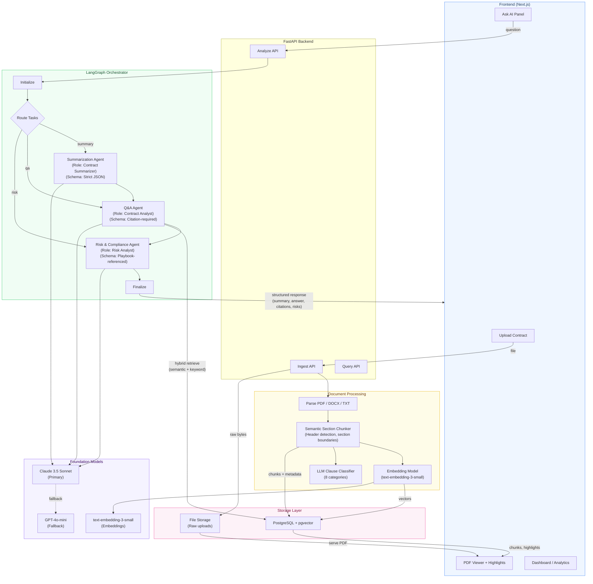

# Contract Intelligence — Architecture

## Component Summary

| Layer | Technology | Purpose |
|-------|-----------|---------|
| **Frontend** | Next.js, React, react-pdf | PDF viewer with clause highlights, Ask AI chat, dashboard |
| **API** | FastAPI | REST endpoints for ingest, analyze, query, file serving |
| **Orchestrator** | LangGraph | Routes tasks to specialized agents with shared state |
| **Agents** | Role-specific prompts + strict schemas | Summarization, Q&A, Risk analysis |
| **Retrieval** | Hybrid (semantic + keyword) | pgvector cosine similarity + keyword fallback |
| **Embeddings** | text-embedding-3-small via OpenRouter | 1536-dim vectors stored in pgvector |
| **Classification** | LLM-based clause classifier | 8 contract clause categories |
| **Chunking** | Semantic section detection | Header/clause boundary detection |
| **LLM** | Claude 3.5 Sonnet / GPT-4o-mini | Primary + fallback via OpenRouter |
| **Database** | PostgreSQL + pgvector | Contracts, chunks, embeddings, runs, traces |
