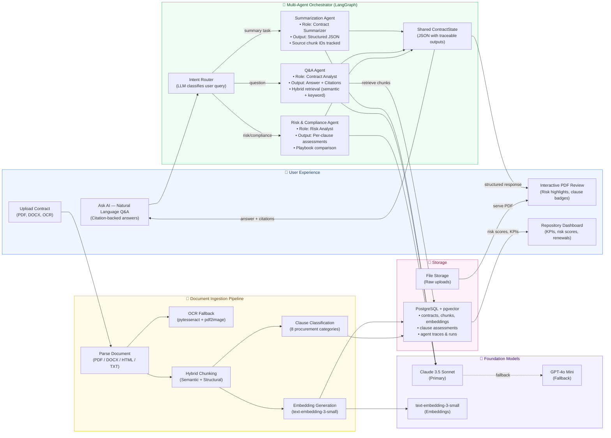

# Contract Intelligence Platform — High-Level Architecture

> **Purpose**: This diagram maps directly to the requirements discussed in the case study and hiring manager conversation. Each numbered block corresponds to a specific ask from the transcript.

---

## System Overview (Presenter Diagram)



---

## How This Maps to What They Asked

| # | What the Hiring Manager / Case Study Asked | Where It Lives in the System |
|---|---|---|
| 1 | **Multi-agent orchestration with LangGraph** | `ORCH` — LangGraph StateGraph with conditional routing, shared `ContractState`, `AgentTrace` |
| 2 | **Specialized agents** (ingestion, clause extraction, summarization, Q&A, risk/compliance) | 5 agents: `IngestionAgent`, `ClauseExtractionAgent`, `SummarizationAgent`, `QAAgent`, `RiskComplianceAgent` |
| 3 | **Agents share structured contract state (JSON) with traceable outputs** | `ContractState` Pydantic model flows through every agent; `AgentTrace` logs every step |
| 4 | **Orchestrator agent to interpret user intent and route tasks** | `OrchestratorAgent` uses LLM-based intent classification → routes to correct agent |
| 5 | **Document ingestion (PDF, DOCX, OCR)** | `INGEST` pipeline — PDF parsing, DOCX extraction, OCR via pytesseract |
| 6 | **Clause extraction and normalization** | Hybrid chunking (semantic similarity + regex headers) → LLM clause classifier (8 categories) |
| 7 | **RAG-based Q&A with citations** | `QAAgent` — hybrid retrieval (pgvector cosine + keyword), `QACitation` objects with chunk IDs, page numbers, text |
| 8 | **Risk and compliance analysis** | `RiskComplianceAgent` — per-clause risk scoring (0-100), deviation detection, playbook comparison |
| 9 | **Prompting strategy: role-specific prompts, strict output schemas, citation-required** | Every agent has a role prompt, Pydantic-enforced JSON schema, and citation tracking |
| 10 | **PDF-first UI with highlights, risk badges, interactive review** | `USER` layer — pdf.js iframe, category-colored highlights, inline risk badges, pulse on click |
| 11 | **Compliance checklist with playbook comparison** | Clause Library + gap detection, inline side-by-side vendor vs. standard text, word-diff highlighting |
| 12 | **Repository with KPIs and risk overview** | Dashboard with metric tiles, risk donut scores, renewal countdowns, status badges |

---

## Data Flow (The Story to Tell)

```
                    ┌─────────────────────────────────────────────────────┐
                    │                   USER UPLOADS PDF                   │
                    └─────────────────────┬───────────────────────────────┘
                                          │
                                          ▼
                    ┌─────────────────────────────────────────────────────┐
                    │              DOCUMENT INGESTION PIPELINE             │
                    │                                                     │
                    │  PDF/DOCX → Text Extraction (+ OCR if scanned)     │
                    │  → [[PAGE:N]] markers inserted                      │
                    │  → Hybrid Chunking (semantic + structural)          │
                    │  → LLM Clause Classification (8 categories)         │
                    │  → Embedding (text-embedding-3-small, 1536-dim)     │
                    │  → Store chunks + vectors in PostgreSQL/pgvector    │
                    └─────────────────────┬───────────────────────────────┘
                                          │
                                          ▼
                    ┌─────────────────────────────────────────────────────┐
                    │            USER CLICKS "ANALYZE" or "ASK AI"        │
                    └─────────────────────┬───────────────────────────────┘
                                          │
                                          ▼
              ┌───────────────────────────────────────────────────────────────┐
              │                   LANGGRAPH ORCHESTRATOR                      │
              │                                                               │
              │   ┌──────────┐    ┌──────────────────────────────────────┐   │
              │   │ INTENT   │───▶│  Conditional Routing                 │   │
              │   │ ROUTER   │    │  • "Summarize this" → Summarization  │   │
              │   │ (LLM)    │    │  • "What is the term?" → Q&A         │   │
              │   └──────────┘    │  • "Analyze risks" → Risk Agent      │   │
              │                    │  • "Full analysis" → All agents      │   │
              │                    └──────────┬───────────────────────────┘   │
              │                               │                               │
              │         ┌─────────────────────┼─────────────────────┐         │
              │         ▼                     ▼                     ▼         │
              │  ┌──────────────┐   ┌──────────────┐   ┌──────────────────┐  │
              │  │ Summarization│   │   Q&A Agent   │   │ Risk/Compliance  │  │
              │  │    Agent     │   │               │   │     Agent        │  │
              │  │              │   │ Hybrid RAG:   │   │                  │  │
              │  │ • Structured │   │ • Vector sim  │   │ • Per-clause     │  │
              │  │   summary    │   │ • Keyword     │   │   scoring (0-100)│  │
              │  │ • Source IDs │   │ • Citations   │   │ • Deviation flags│  │
              │  │   tracked    │   │   with pages  │   │ • Recommendations│  │
              │  └──────┬───────┘   └──────┬───────┘   └──────┬───────────┘  │
              │         └─────────────────┬┘───────────────────┘              │
              │                           ▼                                   │
              │              ┌────────────────────────┐                       │
              │              │  Shared ContractState   │                       │
              │              │  (JSON + AgentTrace)    │                       │
              │              └────────────┬───────────┘                       │
              └───────────────────────────┼───────────────────────────────────┘
                                          │
                                          ▼
              ┌───────────────────────────────────────────────────────────────┐
              │                    FRONTEND RENDERS RESULTS                    │
              │                                                               │
              │  ┌─────────────┐  ┌──────────────┐  ┌─────────────────────┐  │
              │  │  PDF Viewer  │  │  Review Panel │  │   Ask AI Chat       │  │
              │  │             │  │              │  │                     │  │
              │  │ • Category- │  │ • AI Summary │  │ • Citation-backed   │  │
              │  │   colored   │  │ • Clause     │  │   answers           │  │
              │  │   highlights│  │   risk list  │  │ • Source cards with  │  │
              │  │ • Risk      │  │ • Missing    │  │   page + section    │  │
              │  │   badges    │  │   clause     │  │ • Highlights synced  │  │
              │  │ • Pulse on  │  │   warnings   │  │   to PDF             │  │
              │  │   click     │  │ • Compliance │  │                     │  │
              │  │             │  │   checklist  │  │                     │  │
              │  └─────────────┘  └──────────────┘  └─────────────────────┘  │
              └───────────────────────────────────────────────────────────────┘
```

---

## Key Design Decisions (Talking Points)

| Decision | What We Chose | Why |
|----------|---------------|-----|
| Orchestration | **LangGraph** (not LangChain agents) | Explicit state control, conditional routing, full traceability |
| Vector store | **pgvector** (not Pinecone) | Single DB for structured + vector data; sufficient at procurement scale |
| Chunking | **Hybrid** (semantic + structural) | Pure semantic misses section headers; pure structural misses context |
| Retrieval | **Hybrid RAG** (cosine similarity + keyword) | Semantic alone misses exact terms ("Net 90"); keyword alone misses meaning |
| LLM routing | **LiteLLM + OpenRouter** | Model-agnostic; primary Claude 3.5 + GPT-4o fallback without code changes |
| PDF rendering | **pdf.js in iframe** | Performance isolation, security sandboxing, direct canvas highlighting |
| Risk assessment | **Per-clause scoring (0-100)** | Granular, not binary; maps to visual donut/badge in UI |
| Prompting | **Role + Schema + Citation** per agent | Reduces hallucination, enforces structure, enables traceability |

---

## One Sentence to Open the Presentation

> "We built a multi-agent RAG system on LangGraph that ingests any contract document, breaks it into semantically meaningful clauses, runs specialized AI agents for summarization, Q&A, and risk scoring — all sharing a traceable JSON state — and renders the results as an interactive PDF review experience with inline highlights, risk badges, and citation-backed answers."
