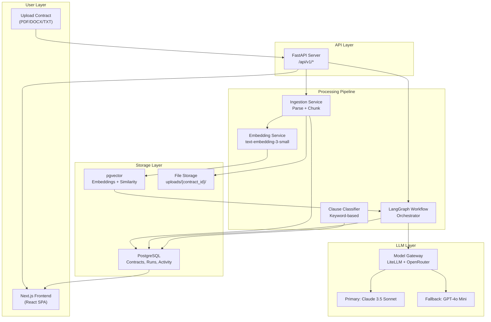
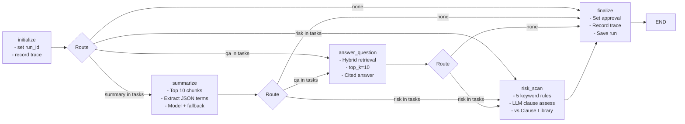
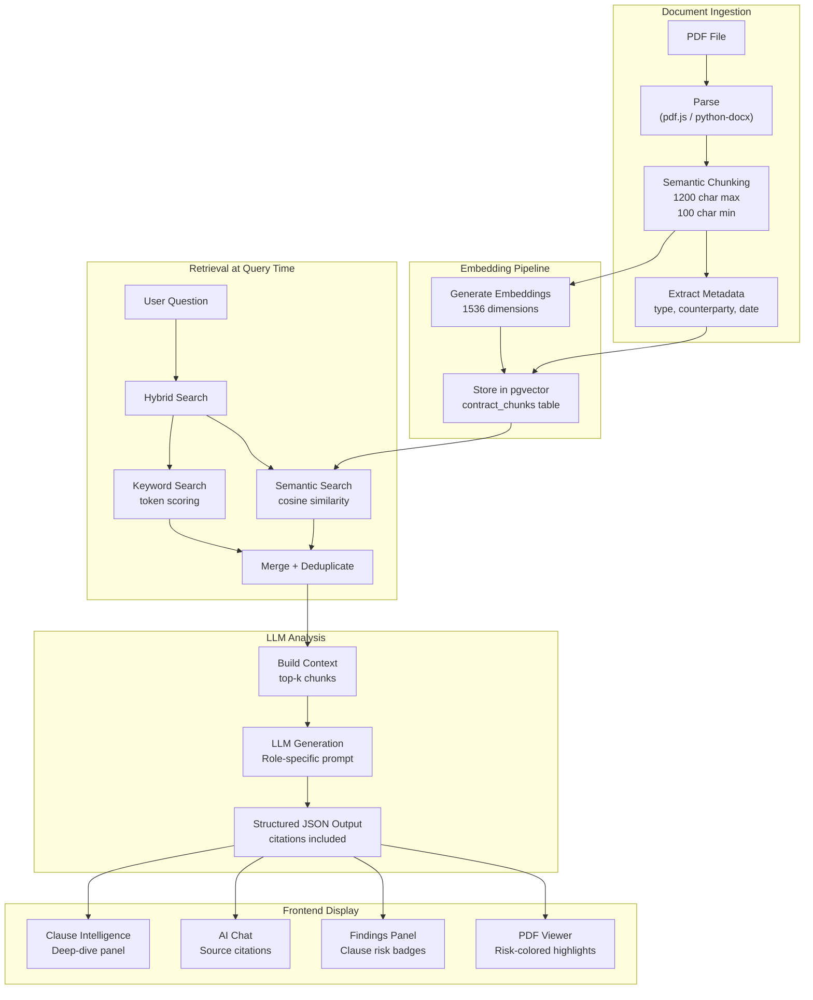
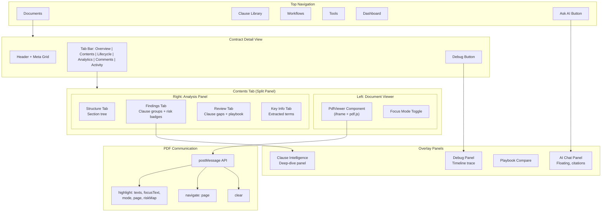
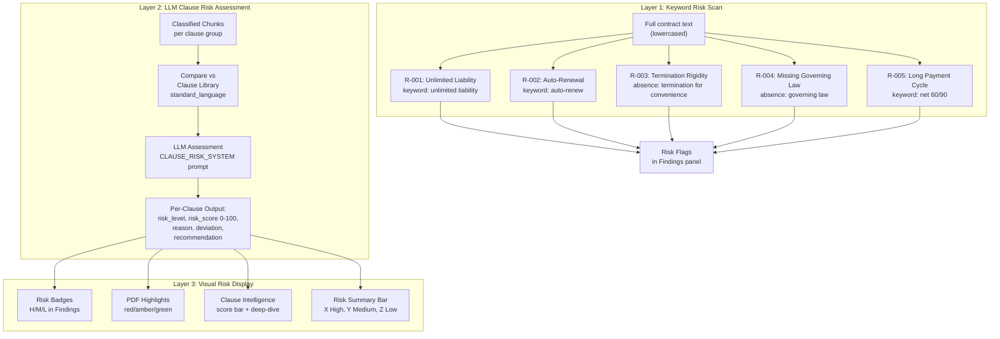
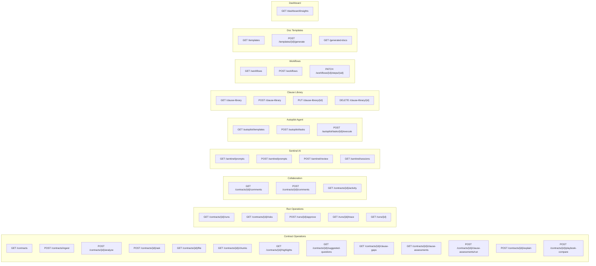

# Contract Intelligence Platform — System Architecture

## 1. High-Level Architecture

End-to-end flow from document upload to user-facing insights.

## 2. LangGraph Workflow

The orchestration engine that routes tasks through specialized agents.

## 3. Data Flow

How a PDF moves from upload through to displayed insights.

## 4. Frontend Component Architecture

How the Next.js SPA is structured.

## 5. Risk Assessment Pipeline

How risk is evaluated at multiple levels.

## 6. API Endpoint Map

All backend routes grouped by domain.

## Technology Stack

| Layer | Technology | Purpose |
|-------|-----------|---------|
| Frontend | Next.js 14 (App Router), React, TypeScript | Single-page application |
| PDF Viewer | pdf.js via iframe, postMessage API | In-browser PDF rendering + highlighting |
| Charts | Recharts | Bar charts, line charts (no pie charts) |
| API | FastAPI (Python 3.11+) | REST API server |
| Orchestration | LangGraph (StateGraph) | Multi-agent workflow routing |
| LLM | LiteLLM + OpenRouter | Claude 3.5 Sonnet (primary), GPT-4o Mini (fallback) |
| Embeddings | text-embedding-3-small | 1536-dimension vectors |
| Database | PostgreSQL + pgvector | Structured data + vector similarity |
| Containerization | Docker Compose | PostgreSQL container |

## Database Schema (Key Tables)

| Table | Primary Key | Purpose |
|-------|------------|---------|
| contracts | contract_id | Contract metadata |
| contract_chunks | (contract_id, chunk_id) | Parsed text chunks with embeddings |
| runs | run_id | Analysis run results + trace |
| clause_risk_assessments | assessment_id | Per-clause LLM risk scores |
| clause_library | clause_id | Standard clause definitions |
| workflows | workflow_id | Review workflow tracking |
| workflow_steps | step_id | Individual workflow steps |
| contract_comments | comment_id | User comments |
| contract_activity | activity_id | Activity audit log |
| prompt_templates | prompt_id | Sentinel AI prompts |
| review_sessions | session_id | Sentinel review results |
| agent_tasks | task_id | Autopilot agent tasks |
| doc_templates | template_id | Document generation templates |
| generated_docs | doc_id | Generated documents |
